# Teammeeting 17 - 12.01.23

:::info
Nächstes Meeting: 19.01.23
Protokollant: Niggo
Anwesend: Luke, Niggo, Corny, Olüvia
Abwesend: Alex

Anfang: irgendwann nach um 9  Uhr
Ende: 10:45 Uhr
:::

### Agenda
- Sprint auswerten
- new year new gadsen things

### ...bis zu diesem Meeting..

- Bugs fixen 

### Top 0 - Meeting beginnen

* Blitzlicht
* Protokollant festlegen
* Agenda ansprechen
* Punkte vom letzten Meeting durchgehen

### Top 1 - Allgemeines zum Projekt | Organisatorisches

#### Top 1.1 Sprint zusammenfassen

- allgemein nicht viel passiert die Woche
    - Bug fix bzgl crash mit dem Menu
    - im Meeting fix für falsche Richtung

#### Top 1.2 Todays Ablauf is/was different + Vorschläge für Protokoll/Meeting

- Protokoll/Meetingänderungsvorschläge

- Struktur

> Top 1 : Allgemeines
> -> Sprint war gut/schlecht
> 
> Top 2 : Teams
> **Programmierung**
> **Design**
> **Testing**
> **Orga**
>
> - was ist passiert/hat sich geändert
> - was steht an? 
> - Probleme/Hilfe

  

#### Top 1.3 Roadmap | *Wie gads'n weiter?*

**Teams**

```mermaid
flowchart TD
    goal1["Bugs Fixen 
    🟢🟣🔵🔴🟠"]
    goal2[Prüfungsphase]
    goal3-1["Skins 
    🟢🟣"]
    goal3-2["Decorator für Waffen 
    🟠🔵"]
    goal3-3["Debug Info UI 
    🔴"]
    goal3-4["Better InGame UI 🔴"]
    goal4["mehr Content"]
    feature1["UI | HUD Anzeige für Spielerinfos
    🔴🟣"]
    feature2["neue Waffen 
    🔵🟢🟠"]
    feature3["neue Mechanics
    🟣🟠"]
    goal5[Wettbewerb]
   
   date1[26.01.23]
    date2[23.02.23]
    date3[31.03.23]
    date4[30.04.23]
    
    goal1-->date1-->goal2
    goal2-->date2
    date2--> goal3-1 & goal3-2 & goal3-3 & goal3-4
    goal3-1 & goal3-2 & goal3-3 & goal3-4 --> date3
    date3-->goal4
    goal4-->feature1 & feature2 & feature3
    feature1 & feature2 & feature3 --> date4
    date4-->goal5
```

#### Top 1.2 Meetingvorschlag

- neuen Sprint am Ende festlegen
- sind bisher meist immer in Top 1 Stuck

**es folgt das alte protokoll leicht überarbeitet**

#### Top 1.3 Was ansteht 

- [ ] [Bugs fixen](https://docs.google.com/spreadsheets/d/1HnVIs3QIsRryI__0hmVg-0mRscZDW72KizyX7pTgiaQ/edit#gid=0)

- [ ] neue Sprites
    - Character

- [ ] Pastebinverweis auf den Beispiel-Bot entfernen 

- [ ] evtl. anpassungen für Fancy neuen Apple Chip

#### Top 1.4 Ideen 

- Decorator für Waffen generierung
    - Design Team liefert Ideen mit Waffen und Sprites
    - durch Dec Pattern einfaches erstellen von neuen Waffen

- Skin Shader mit Texture Mapping
    - Müsli sagt: is drin

- Debug Interface
    - Spielinformationen darstellen

- AssetManager updaten

### Top 2 - Design | Spiel

#### Top 2.1 
- Dateinamen sind etwas funky und umständlich
    - Dateistruktur refactorn 
        - [ ] Namen vereinfachen
        - [ ] Ordnerstruktur nutzerfreundlicher machen
- Tile destroy animation
#### Top 2.2 Aufgaben 

- [ ] Website anpassen
- [ ] Dateistrukturrefactor

### Top 3 - Programmierung | Spiel

#### Top 3.1 Derzeitige Probleme

##### Character

- Character fallen manchmal zu schnell durch Kisten hindurch
- Character sind manchmal stuck in Boxen
- fallen random hindurch
- fallen nicht sofort wenn etwas zerstört wird

##### Gamestate/Map 

- Boxen die nicht geankert sind fallen gelegentlich nicht herunter
- Classloader hat Probleme, wenn der Bot Subklassen enthält 

- Installationsanleitung haut nicht ganz hin
    - test bot kann nicht 1zu1 kopiert werden
        - Packages, sowie Imports müssen angepasst werden

- main branch hat nicht die aktuellste version
    - hardgecodete maps sich nicht enthalten

- camera springt sehr zwischen den zügen schnell
    - option zum ausschalten/ camera soll sich langsam bewegen zwischen den zügen

- der Zug wird nicht sofort beendet wenn man gewinnt
    - dauert gelegentlich noch einen zug bis das Spiel als beendet gilt
        - somit wird die Sieges/Niederlage anzeige zu spät/gar nicht gezeigt
##### Map Dateien

- manche Maps können nicht geladen werden
    - zu wenig spawnpunkte

##### Menu

- Auslagern des Menü erstellens in eine extra klasse
    - GameSettings ist viel zu überladen
    - evtl. GameSettings sofort in RunConfiguration überführen

- laden der Maps erfolgt nicht korrekt
- pfade relativ zur jar werden genutzt
    - wird die jar verschoben klappt es nicht
    - maps hardcoded

##### Application

- Coolcat soll als App icon verwenden
     
#### Top 3.2 Aufgaben

- [ ] Boxverhalten fixen
- [ ] Character Kollission anpassen/Kistenprobleme
- [ ] Classloader Problem beheben
- [ ] Zug/Spielbeenden anpassen
- [ ] Coolcat als GameIcon nutzen

#### Top 3.3 Changelog für Änderungen später

- Pad mit Änderungen 
    - Neue Features
    - Fixes
        - Bugs

- Vorschlag unterteilung wegzulassen
    - stattdessen features vorstellen und dann ein Spreadsheet mit gefixten Bugs anhängen
 
#### Top 3.4 Petition "auf Mio bauen wir auf"

:::danger

- Mio immer als Test Bot nehmen

:::
##### Top 3.5 Refactoring

- [ ] Refactoring
    - nach Zweck getrennt
        - Gamesettings :(
    - utility Klasse
        - Globale Variablen und Hilfsfunktionen
    - Asset Loading in den AssetManager verlagern
    - aufräumen
    - dokumentieren

##### Top 3.6 für nach dem Refactoring

- [ ] Camera auf bestimmten Punkt fokussieren
- [ ] Camera-Entity
- [ ] Texture Lookup/Gadsen Skins

### Top 4 - Gemeinsames | Spiel

:::warning
**Erinnerung**

HackNPlan hat  Board für Bugs und Refactoring

- jedes Package bekommt eine User-Story und somit einen Branch

---

Falls große Bugs im Discord herangetragen werden, lieber an Kontaktinfo auf der Website weiterleiten.
:::

### Top 5 - ToDos
#### Top 5.1 - bis zum nächsten Meeting

- erst Bugs fixen

#### Top 5.2 - Zeitlich relevantes TO-DO

**Luke**
- [ ] interne Docs
- [ ] BUGS FIXEN

**Olivia**
- [ ] Concept Art

**Niggo**
- [ ] Concept Art
- [ ] Protokoll Backup

**Alex**
- [ ] Concept Art

**Corny**

- [ ] **UNITY PROTOTYP** pmbok
