# Teammeeting 18 - 19.01.23

:::info
Nächstes Meeting: 26.01.23
Protokollant: Niggo
Anwesend: Corny false Spot nelius, Luke, Nüggo, Olivia, Yasmin
Abwesend: Axel because Bewerbung

Anfang: irgendwann nach um 9  Uhr
Ende: 10:45 Uhr
:::

### Agenda
- Einreichungen anschauen (Top 2.4)
- Sprint zusammenfassen

### ...bis zu diesem Meeting..

- Bugs fixen 

> Design 🟢
> Programmierung 🟣Müsli 🔵Luke 🔴Schniggo
> Testen 🟠
> Orga 

```mermaid
flowchart TD
    goal1["Bugs Fixen 
    🟢🟣🔵🔴🟠"]
    goal2[Prüfungsphase]
    goal3-1["Skins 
    🟢🟣"]
    goal3-2["Decorator für Waffen 
    🟠🔵"]
    goal3-3["Debug Info UI 
    🔴"]
    goal3-4["Better InGame UI 🔴"]
    goal4["mehr Content"]
    feature1["UI | HUD Anzeige für Spielerinfos
    🔴🟣"]
    feature2["neue Waffen 
    🔵🟢🟠"]
    feature3["neue Mechanics
    🟣🟠"]
    goal5[Wettbewerb]
   
   date1[26.01.23]
    date2[23.02.23]
    date3[31.03.23]
    date4[30.04.23]
    
    goal1-->date1-->goal2
    goal2-->date2
    date2--> goal3-1 & goal3-2 & goal3-3 & goal3-4
    goal3-1 & goal3-2 & goal3-3 & goal3-4 --> date3
    date3-->goal4
    goal4-->feature1 & feature2 & feature3
    feature1 & feature2 & feature3 --> date4
    date4-->goal5
```

### Top 0 - Meeting beginnen

* Blitzlicht
* Protokollant festlegen
* Agenda ansprechen
* Punkte vom letzten Meeting durchgehen

### Top 1 - Allgemeines zum Projekt | Organisatorisches

#### Top 1.1 Sprint zusammenfassen

- lief gut

### Top 2 - Teams

#### 2.1 Teamleitung Programmierung

#### 2.1.1 Was ist passiert

- Linksschuss funktioniert
- Laser richtig gerendert mit Winkel
- Maps werden geladen aus /maps dir relativ zur jar
- Laufen funktioniert
- Kisten noch in Arbeit
- Icons

- Maps können mit 

- Threshhold für transparente sprites bei dem Shader hochsetzen

#### 2.1.2 Features for the after Refactor

- Debug interface 
    - Winkel mit zahlen und Grad
    
- Maus aim

- UI mit zeugs

- fastForward

- Kamera springen anpassen

- Laser fliegt bei default aim durch boxen

- Mapauswahl anpassen, dass Spawnpunkte beachtet werden.

#### 2.2 Teamleitung Design

- Ordnerstruktur wird angepasst
- wo Tiledestroy :'(?
- animation des Characters hat evtl. nicht ganz transparente Pixel

#### 2.3 Teamleitung Testing

- Tests brauchen wir erstmal nicht weiter
    - können wir graphisch testen

#### 2.4 Teamleitung Orga

- Christians werden nochmal gefragt bzgl. organisatorischem

#### Top 2.4.1 Studi-Einreichungen

- nicht viel Feedback
    - Example Bot war nicht ganz korrekt

- manche hatten Probleme bei der Installation
    - jedoch nicht oft auf uns zugegangen

### Top 3 - ToDos
#### Top 3.1 - bis zum nächsten Meeting

- alle bisherigen Bugs fixen

#### Top 3.2 - Zeitlich relevantes TO-DO

**Luke**
- [ ] Christians zu Orga fragen
- [x] BUGS FIXEN

**Olivia**
- [ ] Concept Art

**Niggo**
- [ ] Menu refactoring
- [ ] Map Spawnpoins im Menu anpassen
- [ ] Concept Art
- [ ] Protokoll Backup

**Alex**
- [ ] Concept Art

**Corny**
- [ ] Treshold beim Shader
- [ ] **UNITY PROTOTYP** pmbok
