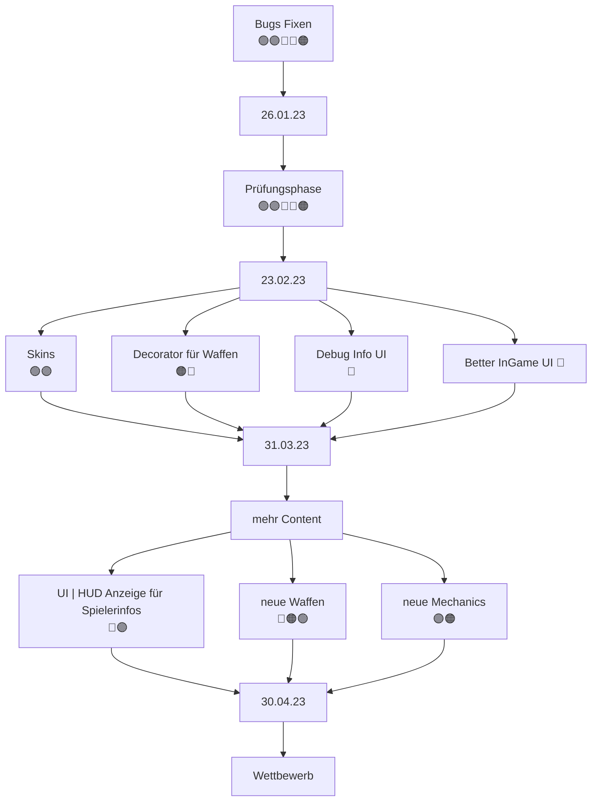

# Teammeeting 19 - 26.01.23

:::info
Nächstes Meeting: 23.02.23? R334
Protokollant: Niggo
Anwesend: Luke, Corny, Olivia, Alex 
Abwesend: 

Anfang: irgendwann nach um 9  Uhr
Ende: Design won't let us leave
:::

### Agenda

- Sprint zusammenfassen
- Plan für die Semesterpause
- neue Features

### ...bis zu diesem Meeting..

- alle bisherigen Bugs fixen

> Design 🟢
> Programmierung 🟣Müsli 🔵Luke 🔴Schniggo
> Testen 🟠
> Orga 

### Top 0 - Meeting beginnen

* Blitzlicht
* Protokollant festlegen
* Agenda ansprechen
* Punkte vom letzten Meeting durchgehen

### Top 1 - Allgemeines zum Projekt | Organisatorisches

Raum 334 is superior.

#### Top 1.1 Sprint zusammenfassen

- nicht viel passiert 

### Top 2 - Teams

#### 2.1 Teamleitung Programmierung

#### 2.1.1 Was ist passiert

#### 2.1.2 Features for the after Refactor

- Debug interface 
    - Winkel mit zahlen und Grad
    
- Maus aim

- UI mit zeugs

- fastForward

- Kamera springen anpassen

- Laser fliegt bei default aim durch boxen

- Mapauswahl anpassen, dass Spawnpunkte beachtet werden.

#### 2.2 Teamleitung Design

- wo Tiledestroy :'(?

#### 2.3 Teamleitung Testing

#### 2.4 Teamleitung Orga

- Christians wurden nochmal gefragt bzgl. organisatorischem
- Abschlusspräsentation im Ende März

- Api freeze, mitte April
  - alles muss fertig sein
  - 
  - nur noch bugs fixen
#### 2.4.1 potentielle Features
Was kommt noch ins Spiel?

##### 2.4.1.1 Vorschläge/Besprechung

- Vorschlag: Grundgerüst steht, vorallem Quality of Life anpassen
- Studis fragen nach Ideen?
    - nicht viele Studis haben sich mit Gadsen beschäftigt und vermutlich wenig Kapazitäten um sich über Vorschläge Gedanken zu machen

- Wind
    - Umsetzung könnte schwierig werden
    - Ebenso für die Studis umso schwerer dafür 

###### Waffen

- Waffen pro Character vs. Spieler
    - Diskussion für Christians

- Portal Gun?
    - funky physics :(
    - Durchschießen
    - nur seitlich platzieren?
    - eigene Portalwaffe erstellen 
        - gadsen können nur seitlich in Portale hinein
    - one time use portal für Gadsen
        - schüsse mehrfach, aber begrenzt (maybe 3x)
    - dauert Zeit um Bugfrei zu implementieren
    
- Dimension Gun
    - Portal und darf aussuchen wohin man teleportiert wird
    - evtl. Probleme mit der Api

- Beide Portal Guns eher experimentell

- Sprungwaffe
    - evtl. positiver Rückstoß
    - ansonsten wie Rocketjump einbringen
    - Sprungranate/Satchel

- Waffe welche Boxen in anker umwandelt

- Bohrerwaffe, zerstört mehrere Boxen

- Waffe welche zufällig bisherige Waffen unter den Spielern verteilt

- Stubser von Worms

- Vodoo Puppe
    - selber schaden machen, doch jemand anderes bekommt den Damage
    
- Bouncing Projectiles

###### Boxen

- Röhrenboxen
    - mariopipes anstatt portalen

- Supply boxen füllen Munition auf, für die Standard Waffen
    - schaltet Ebenso eine neue Waffe frei
    - bestimmte Reihenfolge, mit der man neue Waffen erhält

 
- mehr Box Typen
    - Eis, Gadsen rutschen entlang

- Bauen und Buddeln?
    - boxen platzieren
    - mehrere Boxen zerstören
    - Barrikaden bauen

- nicht zu viel

##### tl;dr

- Waffentypen
    - bounce
    - piercing
    - Granaten/Wurfminen
    - Rückstoß
- Boxtypen
    - Waffen
    - Eis

- allgemeine Idee für Wettbewerb
    - Tutorial/Snippets für Nutzung der Waffen bereit stelle
    - Konzeptuelle Anleitung erstellen um Studis hilfestellung zu geben

##### 2.4.1.2 Für die Liste | Neuer Content

- wann api freeze?

- Rückstoß
    - Sprung wird damit implementieren

- neue Boxarten
    - Eis, Röhren, Supply
- neue Waffen + Typen

- Wind maybe, but hard
- ? Skins mit Texturelookup

        
### Top 3 - ToDos
#### Top 3.1 - bis zum nächsten Meeting

#### Top 3.2 - Zeitlich relevantes TO-DO

**Luke**
- [x] Christians zu Orga fragen

**Olivia**
- [ ] Concept Art

**Niggo**
- [ ] Menu refactoring
- [ ] Map Spawnpoins im Menu anpassen
- [ ] Concept Art
- [ ] Protokoll Backup

**Alex**
- [ ] Concept Art

**Corny**
- [ ] Treshold beim Shader
- [ ] **UNITY PROTOTYP** pmbok
