# Teammeeting 20 - 23.02.23

:::info
Nächstes Meeting: 01.03.23?
Protokollant: Niggo
Anwesend: Corny, Alex, Luke, Olivia ,Niggo
Abwesend: 

Anfang: 12:00  Uhr
Ende: 
:::

### Agenda

- Sprint zusammenfassen
- Abschlusspräsi
### ...bis zu diesem Meeting..

- alle bisherigen Bugs fixen
- Refactor

> Design 🟢
> Programmierung 🟣Müsli 🔵Luke 🔴Schniggo
> Testen 🟠
> Orga 

```mermaid
flowchart TD
    goal1["Bugs Fixen 
    🟢🟣🔵🔴🟠"]
    goal2["Prüfungsphase
     🟢🟣🔵🔴🟠"]
    goal3-1["Skins 
    🟢🟣"]
    goal3-2["Decorator für Waffen 
    🟠🔵"]
    goal3-3["Debug Info UI 
    🔴"]
    goal3-4["Better InGame UI 🔴"]
    goal4["mehr Content"]
    feature1["UI | HUD Anzeige für Spielerinfos
    🔴🟣"]
    feature2["neue Waffen
    🔵🟠🟢"]
    feature3["neue Mechanics
    🟣🟠"]
    goal5[Wettbewerb]
   
   date1[26.01.23]
    date2[23.02.23]
    date3[31.03.23]
    date4[30.04.23]
    
    goal1-->date1-->goal2
    goal2-->date2
    date2--> goal3-1 & goal3-2 & goal3-3 & goal3-4
    goal3-1 & goal3-2 & goal3-3 & goal3-4 --> date3
    date3-->goal4
    goal4-->feature1 & feature2 & feature3
    feature1 & feature2 & feature3 --> date4
    date4-->goal5
```

### Top 0 - Meeting beginnen

* Blitzlicht
* Protokollant festlegen
* Agenda ansprechen

### Top 1 - Allgemeines zum Projekt | Organisatorisches

#### Top 1.1 Sprint zusammenfassen

### Top 2 - Teams

#### 2.1 Teamleitung Programmierung

#### 2.1.1 Was ist passiert

- [x]Menu/GameSettings Refactor
    - Anzahl Team/Charactere begrenzt auf Spawnpunkte
    
- Debug Interface fast fertig

- Corny hat Hitbox gesagt
    
#### 2.1.2 Was steht an? 

**UI**
- Maus aim
- fastForward Knopf
- Kamera springen anpassen
    - lässt sich bisher ausschalten
- Aim Indicator um Zahlen erweitern
    - Winkel und Stärke anzeigen
- Inventar Aussehen im Stil von 
    - an der Seite wie bei Worms
    - toggle mit Tab
- Timer für die Zugdauer
- Splash-Screen für Zugwechsel
    - wer ist am Zug    
    
    
 - Boxen für Menübuttons

- Debug für Studis auslegen, aber auch für 

**Texture Lookup**
- in Arbeit, Shader geschrieben
- wird umgeschrieben
- Fullskin oder nur Teil
    - "3D" darstellung? oder nicht

##### Sim
- Simulation Refactoring
    - Umwandlungsfunktion von Koordinaten
    - Actionerzeugung etwas verbessern

- Laser fliegt bei default aim durch boxen

- Wie viele Leben?
    - 7? könnte beim Balancing für Probleme sorgen
    - eher 70 oder mehr
    - Ui dann aufteilen in 7 Abschnitte
    
**Decorator**
Traits der Waffen:
- portable
- bouncing
- explosive
- recoil (für den Schie른nden)
- knockback (Rückstoß den getroffene Chars erleiden)

##### Wichtig für Später

Turniermodus
- Auswertung/Speicherung der Action-Logs

#### 2.2 Teamleitung Design

- Tiledestroy ist da :)
- Ordnerrefactor ist beendet
    - Kategorien erstellt
    - README mit Beschreibung
    
- Palette für Tiles weitergeben
- neue Boxen

##### Was steht an

#### 2.3 Teamleitung Testing

- ist etwas untergegangen
- wird für Decorator wieder genutzt

#### 2.4 Teamleitung Orga

##### Neuer Sprint

Punkte aus der Roadmap als User-Story im neuen HackNPlan-Board

Verweis nochmal auf letztes Protokoll mit Feature-Besprechung
**tl;dr**

- Waffentypen
    - bounce
    - piercing
    - Granaten/Wurfminen
    - Rückstoß
    - Turret zum werfen?
- Boxtypen
    - Waffen
    - Eis

- allgemeine Idee für Wettbewerb
    - Tutorial/Snippets für Nutzung der Waffen bereit stelle
    - Konzeptuelle Anleitung erstellen um Studis hilfestellung zu geben

**Für die Liste | Neuer Content**

- wann api freeze?
    - ist Api freeze gleich keine updates mehr?

- Rückstoß
    - Sprung wird damit implementieren

- neue Boxarten
    - Eis, Röhren, Supply
- neue Waffen + Typen

##### Auswertung der Abschlusspräsi

- lief gut, Christians wirkten zufrieden

**Anmerkungen der Christians**
- Timer für den Zug
- Splash Screen bei Zugwechselt
- victory/screen -> hintergrund opaque machen
- wie shader auf Systemen ohne GPU handhaben?
- Gummibox
- Wayland und andere spezifische Probleme ins FaQ aufnehmen, um Studis zu helfen und uns Arbeit zu ersparen
- Outline etwas transparenter machen
    - für Farbauswahlinspiration Palettengenerator

:::danger
Prüfunsanmeldung

Zu finden auf der Website des Prüfungsamts.
Eintragen als Fin-Smk.

Für Wifler Gestalten und Anwenden WPF
:::

### Top 3 - ToDos
#### Top 3.1 - bis zum nächsten Meeting

#### Top 3.2 - Zeitlich relevantes TO-DO

**Luke**
- [x] Christians zu Orga fragen

**Olivia**
- [ ] Concept Art

**Niggo**
- [x] Menu refactoring
- [x] Map Spawnpoins im Menu anpassen
- [ ] Concept Art
- [ ] Protokoll Backup

**Alex**
- [ ] Concept Art

**Corny**
- [ ] Treshold beim Shader
- [ ] **UNITY PROTOTYP** pmbok
