# Teammeeting 21 - 02.03.23

:::info
Nächstes Meeting: 09.03.23 (R334)
Protokollant: Cornelius
Anwesend: Luke, Alex, Cornelius
Abwesend: Niggo, Yasmin, Olivia

Anfang: 11:00  Uhr
Ende:   11:30  Uhr
:::

### Agenda

- Sprint anschauen 
- Müsli hat viel zu plappern

### ...bis zu diesem Meeting..

- alle bisherigen Bugs fixen
- Refactor
- Roadmap P2 anfangen

> Design 🟢
> Programmierung 🟣Müsli 🔵Luke 🔴Schniggo
> Testen 🟠
> Orga 

```mermaid
flowchart TD
    goal1["Bugs Fixen 
    🟢🟣🔵🔴🟠"]
    goal2["Prüfungsphase
     🟢🟣🔵🔴🟠"]
    goal3-1["Skins 
    🟢🟣"]
    goal3-2["Decorator für Waffen 
    🟠🔵"]
    goal3-3["Debug Info UI 
    🔴"]
    goal3-4["Better InGame UI 🔴"]
    goal4["mehr Content"]
    feature1["UI | HUD Anzeige für Spielerinfos
    🔴🟣"]
    feature2["neue Waffen
    🔵🟠🟢"]
    feature3["neue Mechanics
    🟣🟠"]
    goal5[Wettbewerb]
   
   date1[26.01.23]
    date2[23.02.23]
    date3[31.03.23]
    date4[30.04.23]
    
    goal1-->date1-->goal2
    goal2-->date2
    date2--> goal3-1 & goal3-2 & goal3-3 & goal3-4
    goal3-1 & goal3-2 & goal3-3 & goal3-4 --> date3
    date3-->goal4
    goal4-->feature1 & feature2 & feature3
    feature1 & feature2 & feature3 --> date4
    date4-->goal5
```

### Top 0 - Meeting beginnen

* Blitzlicht
* Protokollant festlegen
* Agenda ansprechen

### Top 1 - Allgemeines zum Projekt | Organisatorisches

#### Top 1.1 Sprint zusammenfassen

### Top 2 - Teams

#### 2.1 Teamleitung Programmierung

- Decorator bleiben doch! [De de de de](https://www.youtube.com/watch?v=lxBe5XLZ5Qg)
- Viel refactored und dokumentiert
    - sehr saubere Architektur 
    - Klare Trennung: alles für Studenten wichtig ist, ist in Deutsch
    - Alles andere in English
    - Wollte sonst keiner dokumentieren.
- Attribute von Konstante Objekte (z.B. Vector2.Zero) können überschrieben werden
    - Vector2.Zero kann zu (10, 0) geändert werden
    - Nicht verwenden!
    - Eigene konstante Objekte min package private
- Public ist nicht generell ein Problem, nur für methoden die sich von einer GameState oder manager.Controller instanz erreichen lassen
    

#### 2.2 Teamleitung Design

- Where TexLookup?
- Nö, das wollte Olivia machen
- LibDGX's particle system
- Müsli will Beispiel Setup für Lookup schreiben um Pipeline und Konzept zu testen5

#### 2.3 Teamleitung Testing

- ist etwas untergegangen
- wird für Decorator wieder genutzt
- viel aufzuholen

#### 2.4 Teamleitung Orga

- Roadmap P3 rutscht schon in den Part 2 teilweise mit hinein
- nicht weiter schlimm

- wir brauchen ein Turniersystem (nicht in der Roadmap)
- Yasmin ist im Team (hier Applaus einfügen)
    - welche Aufgaben?
    - Sounddesign?
    - Teile der Orga?

### Top 3 - ToDos
#### Top 3.1 - bis zum nächsten Meeting

- Sprinten

#### Top 3.2 - Zeitlich relevantes TO-DO

**Luke**
- [x] Christians zu Orga fragen

**Olivia**
- [ ] Concept Art

**Niggo**
- [x] Menu refactoring
- [x] Map Spawnpoins im Menu anpassen
- [ ] Concept Art
- [ ] Protokoll Backup

**Alex**
- [ ] Concept Art

**Corny**
- [ ] Treshold beim Shader
- [ ] **UNITY PROTOTYP** pmbok
