# Teammeeting 22 - 21.03.23

:::info
Nächstes Meeting: 29.03.23 14:00 Uhr
Protokollant: Niggo
Anwesend: Alex, Luke, Yasmin, WO COOOORRNY?; da corny
Abwesend: Olivia

Anfang: 10:00 Uhr
Ende: Uhr
:::

### Agenda

- Doku Probleme 
- Sprint besprechen

### ...bis zu diesem Meeting..

- Sprinten

```mermaid
flowchart TD
    goal1["Bugs Fixen 
    🟢🟣🔵🔴🟠"]
    goal2["Prüfungsphase
     🟢🟣🔵🔴🟠"]
    goal3-1["Skins 
    🟢🟣"]
    goal3-2["Decorator für Waffen 
    🟠🔵"]
    goal3-3["Debug Info UI 
    🔴"]
    goal3-4["Better InGame UI 🔴"]
    goal4["mehr Content"]
    feature1["UI | HUD Anzeige für Spielerinfos
    🔴🟣"]
    feature2["neue Waffen
    🔵🟠🟢"]
    feature3["neue Mechanics
    🟣🟠"]
    goal5[Wettbewerb]
   
   date1[26.01.23]
    date2[23.02.23]
    date3[31.03.23]
    date4[30.04.23]
    
    goal1-->date1-->goal2
    goal2-->date2
    date2--> goal3-1 & goal3-2 & goal3-3 & goal3-4
    goal3-1 & goal3-2 & goal3-3 & goal3-4 --> date3
    date3-->goal4
    goal4-->feature1 & feature2 & feature3
    feature1 & feature2 & feature3 --> date4
    date4-->goal5
```

### Top 0 - Meeting beginnen

* Blitzlicht
* Protokollant festlegen
* Agenda ansprechen
* Punkte vom letzten Meeting durchgehen

### Top 1 - Allgemeines zum Projekt | Organisatorisches

#### 1.1 aktueller Sprint

- macht eure Aufgaben!
- Arschtritt ans Design-Team!
- Aufgaben bis 31. noch 10 Tage!

**Programmieraufgaben**
- Viele Programmieraufgaben, evtl. mehr Leute die Programmieren
    - Yasmin wird u.a. teil der Orga übernehmen, Luke hat somit mehr Zeit für die Programmierung
   
   
**Tests**
- Brauchen hinzu noch Tests für den ganzen Code (nicht im HackNPlan)
    - Tests schreiben ist nicht all zu komplex
    - Alex würde gerne noch Tests schreiben, erstmal Design-Aufgaben

**Texture Lookup**
- Olivia?
    - Texture-Lookup hängt gerade dran
        - Animationen/Texturen fehlen

    - Corny macht Texture-Lookup mit Beispielen fertig
        - kann Alex zeigen wie es funktioniert

    - Prokrastination ist teils Problem
        - Probleme die Farben umzusetzen
        - Lösung: gemeinsamen Termin im Discord finden zum Arbeiten
            - Corny versucht

:::success
Können uns in den Discord setzten, Luke sitzt gerne öfters drin für Fragen/gemeinsames Arbeiten
:::

**fehlende Texturen/Tasks**

- fast zu allen Tasks fehlen Texturen
 

##### Top 1.1.1 Aufgabenverteilung

**Wettbewerbsmodus**

- Corny sitzt dran

**Partikel**

- nicht sehr wichtig, können warten
- nebenbei möglich

#### 1.2 Wettbewerb

- unser Fortschritt ist ziemlich gut (Feedback)
- Idee: Kampagne für schrittweise Hinführung zum vollständigen Bot

**Einreichung**

ab 30.04. bis 23.06

**Preisverleihung**

Montag der 3. Juli

Budget: 500-600€

Preise?
thematisch:
- Tshirts mit Katzen
    - Coolcat als Motiv?
    - oder Patches/Pins
- Plushies
- Sticker

Tech/Gebrauchsgegenstände:
- Computerzubehör
    - Mäuse
    - Festplatten/USB-Sticks
    - Kopfhörer mit Katzenohren
    - ....
### Top 2 - Teams
#### 2.1 - Teamleitung Programmierung

- wäre cool wenn wir mehr dokumentieren könnten

#### 2.2 - Teamleitung Design

- Inventarsprites
:::success 

:::

- Zahlen müssen noch angepasst werden
    - grauer Hintergrund
    - oder Box-Drumrum
     
#### 2.3 - Teamleitung Testing

Neue Konventionen

Bisher:

- Tester kann erst etwas damit anfangen, wenn es fertig programmiert ist,
    -  muss warten bis die Arbeit anfangen kann

Neu:

- Tasks erhalten Methodensignaturen, die getestet werden sollen
    - werden von Anfang an gepusht, damit gearbeitet werden kann
  
- Bei Änderung der Signatur/Methoden, Testperson mitteilen

###  2.4 - Orga 

#### 2.4.1 - Count Dooku hat Probleme

- Keine Probleme mit der Doku
    - Maurice als Tutor, möchte gerne eine Doku mit Dingen, welche Probleme bereiten könnten
        - FaQ wird noch überarbeitet, wird dann helfen können.
        - Bitte nur Tech-Support; Wie mache ich X ist Aufgabe der Studenten -> Auf Doku verweisen
        - falls Bugs aufkommen, weiterleiten an uns-über die Website/Mail
        - sehr spezifische Fragen/was nicht in der Doku ist fragen
        
- Fast alles was nicht für Studis gesichtet werden kann, ist auf Englisch kommentiert

- Sind kein direkter (Tech)-Support, hilfsanfragen lieber an das Aud Tutorial weiterleiten 

#### 2.4.2 Private Nachrichten

- Private Nachrichten bestenfalls ignorieren/weiterleiten an die Website/Mail.

#### 2.4.3 Kampagne

- Reihe von Maps mit steigendem Schwierigkeitsgrad
- Thematisch unterschiedlich

### Top 3 - ToDos
#### Top 3.1 - bis zum nächsten Meeting

#### Top 3.2 - Zeitlich relevantes TO-DO

**Luke**
- [ ] Christians und Thoman zu Preisen etc. fragen
- [ ] Niggo zur Spamliste hinzufügen

**Olivia**
- [ ] Concept Art

**Niggo**
- [ ] Concept Art
- [ ] Protokoll Backup

**Yasmin**
- [ ] 

**Alex**
- [ ] Concept Art

**Corny**
- [ ] Treshold beim Shader
- [ ] **UNITY PROTOTYP** pmbok

