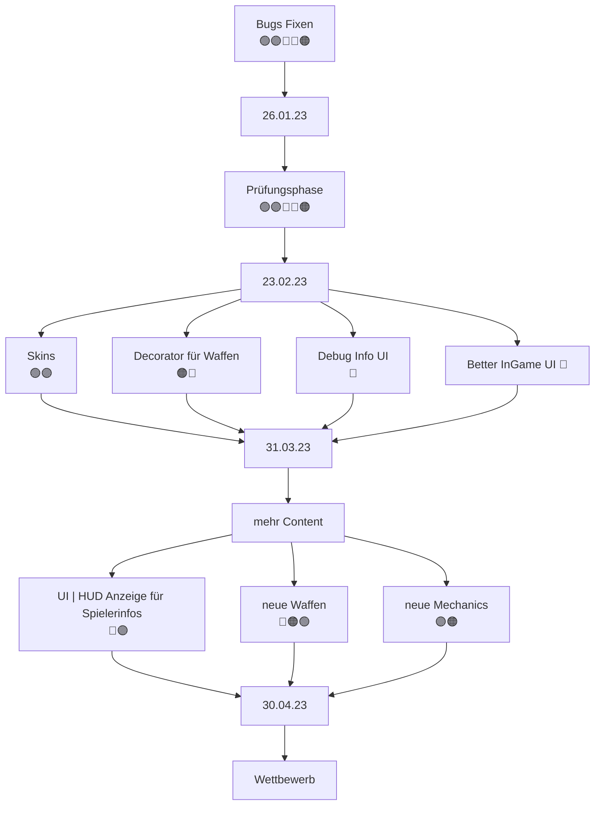

# Teammeeting 23 - 29.03.23

:::info
Nächstes Müting: 
Protokollant: Nüggo
Anwesend: Lüke, Müsli, Yasmüün, Nüggü, Axelütel, Ülivia
Abwesend: -

Anfang: 14:03 Ühr
Ende: 15:24 Ühr
:::

### Agenda

- Waffen Konzept-Ideen besprechen
- Design Regeln besprechen
- Sprint besprechen

### ...bis zu diesem Meeting..

- Sprinten

### Top 0 - Meeting beginnen

* Blützlicht
* Protokollant festlegen
* Agenda ansprechen
* Punkte vom letzten Meeting durchgehen

### Top 1 - Allgemeines zum Projekt | Organisatorisches

#### 1.1 aktueller Sprint

- macht eure Aufgaben!
- Arschtritt ans Design-Team!
- Aufgaben bis 31. noch 2 Tage!

:::danger

**Für die nächsten Sprints**

- Aufgaben nicht erst kurz vor knapp beginnen
- früher anfangen und lieber über die Zeit des Sprints arbeiten
- viele Tasks lassen sich recht schnell erledigen
:::

### Top 2 - Teams
#### 2.1 - Teamleitung Programmierung

##### 2.1.1 Texture-Lookup

- PDF-mit Erklärung wie der Basis-Skin/Template funktioniert
- nachdem man seinen Skin hinzugefügt hat, kümmert sich die Pipeline um das Umwandeln
- Skin lässt sich auch als Animation speichern, so könnte bspw. die Katze durch den Skin blinzeln

##### 2.1.2 Turnier-System

- Wie sieht das Matchmaking aus?
- Bepunktung?
- Brauchen Maps für die Wettkämpfe

**Punkte für:**
Schaden
Kills
Siege

##### 2.1.3 Aufgabe für die Klausurzulassung

Wie bei dem vorherigen Spiel?
- 8 von 12 Runden gewinnen/bestimmte Punktzahl

Kampagnenlevel könnten als Aufbau dafür dienen
- letztes Level ist dann schwieriger und benötigt vollständigen Bot
    - muss mehrere "Skills" anwenden, die in der Kampagne erlernt worden sind
        - verschiedene Waffen benutzen
        - Sprung verwenden
        - Kisten zerstören
        - Zielen, Parabelschuss .etc

#### 2.2 - Teamleitung Design

##### 2.2.1 Design-Regeln für Farbpaletten etc.

Palette benutzen für Sprites, für einheitliche Farbgebung
[Bisherige Palette](https://lospec.com/palette-list/resurrect-64)

##### 2.2.2 - Waffen Konzept-Ideen

- https://md.farafin.de/gadsenDesignDocument#

- Luke Vorschlag
    - für Spielzeug bspw. zum Radius anzeigen, vergrößernder Kreis Animation (wie Radar)

**Ideen/Sprites für Explosionswaffen benötigt**
**Partikel sind wichtig**
- So können wir Dinge rumliegen lassen

- Effekte und Debuffs sind vermutlich zu viel

**Was nehmen wir?**
- Wasserbombe als Sprungwaffe
    - Rückstoß
- Wollknäuel
    - Parabel, Bounceable
- Wasserpistole
    - Linear/Laser

- Krallenangriff
    - Nahkampf
- Stubs
    - Nahkampf rückstoß

**Nachdem Decorator implementiert worden sind, nochmal schauen.**

##### 2.2.3 Konzeptfragen

- Was ist die Funktion einer Schildbox?
    - keiner hat Ahnung :D
    - Katze könnte sich in eine Box/Karton reinsetzen
        - Schildbox=Karton
 
#### 2.3 - Teamleitung Testing

###  2.4 - Orga 

#### 2.4.1 User-Stories

- Für ein Feature User-Story erstellen
    - Tasks für jedes Team erstellen(Programmierung, Design, Testing)
    
    
:::danger
Macht Tasks.
Bei Problemen die anderen Fragen.
Sofort anfangen, immer ein bisschen was machen.
In den Discord setzen.
:::

#### 2.4.2 Mail an Mauricio:

>"Hello ^^
how to gadsen together
>
>- es folgt eine Doku/ FAQ --> ist noch in Bearbeitung
>- erste mögliche Aufgabe: du gehst mit ihnen die Doku durch , bzw. zeigst, wie man die liest
>
>-  wenn dir Bugs gezeigt werden, bitte gesammelt an uns weiterleiten, falls du das uns mitteilen willst oder ihnen unsere Mail geben, dass sie uns direkt schreiben
>
>was eig. klar sein sollte: 
>- für dich sind nur technische Fragen
>- "Wie mach ich, dass..." deutet eher auf eine programmierfrage hin & ist deswegen zu ignorieren, weil is ja die Aufgabe, dass die das rausfinden und so. Wenn denn auf die Doku nochmal verweisen
>
> unsere Mail: wettbewerb@acagamics.de 
>Du bist der einzige, der uns per DM schreiben darf. Die Studis nur per Mail
>
>TL;DR: 
Deine ersten Aufgaben werden sein, die Doku (folgt noch) mit den Studis durchzugehen & Tech Support, wie Installation. Bei weiteren Fragen können sie uns per Mail schreiben."

### Top 3 - ToDos
#### Top 3.1 - bis zum nächsten Meeting

#### Top 3.2 - Zeitlich relevantes TO-DO

**Luke**
- [ ] Christians und Thomas zu Preisen etc. fragen
- [ ] Niggo zur Spamliste hinzufügen

**Olivia**
- [ ] Concept Art

**Niggo**
- [ ] Concept Art
- [ ] Protokoll Backup

**Yasmin**
- [ ] 

**Alex**
- [ ] Concept Art

**Corny**
- [ ] Treshold beim Shader
- [ ] **UNITY PROTOTYP** pmbok

