# Teammeeting 24 - 02.04.23

:::info
Nächstes Müting: 05.04 14-16 Uhr
Protokollant: Nüggo
Anwesend: Luke, Müsli, Yasmüün, Nüggü, Axelütel
Abwesend: Olivia

Anfang: 8:00 Ühr :cry: :coolCat:
Ende:  8:55 Ühr
:::

### Agenda

- Sprint besprechen

### ...bis zu diesem Meeting..

- Sprinten

```mermaid
flowchart TD
    goal1["Bugs Fixen 
    🟢🟣🔵🔴🟠"]
    goal2["Prüfungsphase
     🟢🟣🔵🔴🟠"]
    goal3-1["Skins 
    🟢🟣"]
    goal3-2["Decorator für Waffen 
    🟠🔵"]
    goal3-3["Debug Info UI 
    🔴"]
    goal3-4["Better InGame UI 🔴"]
    goal4["mehr Content"]
    feature1["UI | HUD Anzeige für Spielerinfos
    🔴🟣"]
    feature2["neue Waffen
    🔵🟠🟢"]
    feature3["neue Mechanics
    🟣🟠"]
    goal5[Wettbewerb]
   
   date1[26.01.23]
    date2[23.02.23]
    date3[31.03.23]
    date4[30.04.23]
    
    goal1-->date1-->goal2
    goal2-->date2
    date2--> goal3-1 & goal3-2 & goal3-3 & goal3-4
    goal3-1 & goal3-2 & goal3-3 & goal3-4 --> date3
    date3-->goal4
    goal4-->feature1 & feature2 & feature3
    feature1 & feature2 & feature3 --> date4
    date4-->goal5
```

### Top 0 - Meeting beginnen

* Blützlicht
* Protokollant festlegen
* Agenda ansprechen
* Punkte vom letzten Meeting durchgehen

### Top 1 - Allgemeines zum Projekt | Organisatorisches

- nichts Organisatorisches

- neuer Sprint angelegt
    - Altes Board wiederverwendet
    - geschätzte Zeit eines Tasks eintragen

### Top 2 - Teams
#### 2.1 - Teamleitung Programmierung

- Aufgabenpriorität
    - Decorator
    - Partikel
    - neue Boxen

- durch Skin-System benötigen wir jetzt eine andere Art um die Waffen anzuzeigen

- Turniermodus
    - 4-Teams kämpfen gegeneinander
        - Gruppenphase, alle gegen alle
        - im Finale dann 1v1 x 10
        - Top 3 in mit Animationen nachsimulieren
    - 4!=24 Reihenfolgen, alle simulieren?
    - 3 Character pro Team
    - Actionlogs speichern
    - Replay-System bauen
        - schauen nach "spannenden Logs/Games"
            - Anzahl an Schaden/Tile Move Actions, oder anderen 
        - killing blow in Zeitlupe anzeigen
         
- Parallelisierung
    - finale auf einer Maschine
    - jede Gruppe wird auf einem anderen System simuliert
        - = Leistung wird reingebutter

- Corny hat ein funky-effizientes System für doppelte Frames in Animationen gebastelt
    - Frames können weggelassen werden
        - wird aufgefüllt mit dem nächsthöheren Frame
        - animation_0, animation _3 -> frame 1 und 2 werden mit Bild 3 gefüllt

- Wo bekomme ich die Zeit her für das Ui
    - HumanPlayer schläft für eine gewisse 
        - vor dem Sleep Timer erstellen

- Human Bewegung
    - hängt noch etwas hinterher
        - bei gedrückthalten sind die Move-Actions langsamer als die neuen
            - Polling rate anpassen
    - Animation beim laufen wird ausgeführt
   
- fast-forwardknopf umsetzung
    - delta-time mit einem Faktor multiplizieren
    
#### 2.2 - Teamleitung Design

- Particle-System wurde sich angeschaut
    - Yasmin hat Schleimpartikel gemacht und Schaden wurde angefangen
    - weitere Wünsche?
        - Explosionspartikel, passend zur Explosionswaffe?
        - Teleportationspartikel, wenn etwas durch ein Portal geht
        - Schusspartikel, wenn eine Waffe schie릆

- Boxen, welche zerstört werden liegen dann zerbrochen als Partikel herum
    - Corny macht das
    

- neue Boxen
    - Medibox
    - Schleim
    - Waffenbox
        - version als Anker und Boxen
         

- Ui-Grafiken
    - Uhr, vorerst ohne Animation
    - TurnSplashScreen Sprite
    - fastForward
   
- ui und hud assets sind jetzt nur noch im ui-Ordner

- wichtig sind noch Waffensprites, die dann von den Gadsen gehalten werden 

#### 2.3 - Teamleitung Testing

###  2.4 - Orga 

- Mailverteiler haben Additionen
    - Yasmin, Niggo, Corny
    - olüvia removed

- bitte kein Meeting mehr um 8

### Top 3 - ToDos
#### Top 3.1 - bis zum nächsten Meeting

#### Top 3.2 - Zeitlich relevantes TO-DO

**Luke**
- [ ] Christians und Thomas zu Preisen etc. fragen
- [x] Niggo zur Spamliste hinzufügen

**Olivia**
- [ ] Art

**Niggo**
- [ ] Art
- [ ] Protokoll Backup

**Yasmin**
- [ ] Art 

**Alex**
- [ ] Art

**Corny**

- [ ] **UNITY PROTOTYP** pmbok

