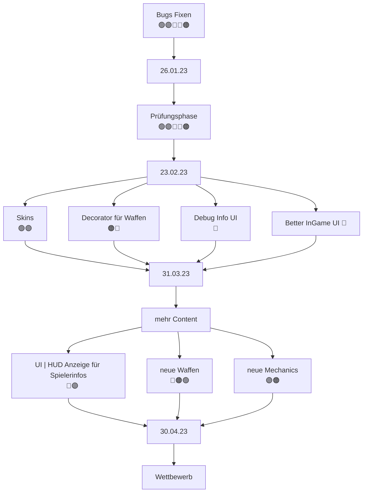

# Teammeeting 25 - 05.04.23

:::info
Nächstes Meeting: 
Protokollant: Niggo
Anwesend: Luke, Niggo, Olivia, Yasmin, Alex, Cornelius
Abwesend: -

Anfang: 14:00 Uhr
Ende: Uhr
:::

### Agenda

- 

### ...bis zu diesem Meeting..

- Sprinten

### Top 0 - Meeting beginnen

* Blitzlicht
* Protokollant festlegen
* Agenda ansprechen
* Punkte vom letzten Meeting durchgehen

### Top 1 - Allgemeines zum Projekt | Organisatorisches

#### 1.1 Sprint zusammenfassen
- läuft gut
#### 1.2 neuen Sprint festlegen

- ist noch genug zu tun

### Top 2 Teamleitungen

#### 2.1 Programmierung

##### 2.1.1 Better-Ui

- Feedback für zwischendurch
    - ist der Radius für das Maus aiming so okay?
    - soll das Inventar nur Zellen anzeigen mit Items welche man besitzt oder auch leere slots
        - wie groß ist das Inventar?
            - in Run config festlegen? 
    - andere Anmerkungen?
   
- Für die Studis müssen wir dann das Debug Interface noch vereinfachen/neue ToString methoden hinzufügen, mit weniger/einfacherem Text

- Stamina anzeige hinzufügen
    - evtl. mit neuer Action nach dem Merge
    - Ui Messenger brauch Methode für Stamina Update
- Camerabewegung als Path umsetzen

- Turnchange mit dem Outlineshader umranden

###### 2.1.2 Waffensprites

- Waffen sind jetzt eigene Sprites, da wir durch den lookup keine Waffen mehr dabei haben
    - Waffe wird im Idle vor die Katze gerendert = hält die Waffe
    - ansonsten auf dem Rücken (kann vorerst auch weggelassen)

#### 2.2 Design

##### 2.2.1 Mappinginginginigingingingnignigniginginginginginginginginginginginginginginginginginginginginginginginginginginginginginginginginginginginginginginginginginginginginginginginginginginginginginginginginginginginginginginginginginginginginginginginginginginginginginginginginginginginginginginginginginginginginginginginginginginginginginginginginginginginginginginginginginginginginginginginginginginginginginginginginginginginginginginginginginginginginginginginginginginginginginginginginginginging

- auf dem Branch für die Maps gibt es eine Anleitung für das Erstellen von Maps
    - [Kevins Hausaufgaben Ordner](https://md.farafin.de/gadsenDesignDocument)
- Struktur des Map-Editor Projektes/maps Ordners geändert
    - Tileset mit neuen Boxen erweitert
        - mehrere Spawnpunkte müssen noch hinzugefügt werden
        - welche Ids sollen welche boxen besitzen?
            - kann man nicht im Editor ändern, aber die tsx lässt sich bearbeiten
                - sollten wir nicht oft machen/gar nicht machen
                    - maps können dadurch "kaputt" gehe
                    

- faire Maps sind wichtig
    - symmetrisch

- erstmal für Prüfungszulassung auslegen
    - evtl. kleiner Maps

- für Wettbewerb dann später designen

**Kampagne**

1. Level von der Insel wegbewegen
2. Level schießen
3. Anker abschießen
4. Springen
5. verschiedene Waffen vorstellen
6. verschiedene Boxen
7. mehrere Spieler
8. mehrere Charaktere

**Vorraussetzungen für Maps**

- Corny hat sich Gedanken gemacht
    - Christian seems to agree

#### 2.2.2 Waffen
Ball of Wool

Watergun

#### 2.2.3 Portal
badabing badabum

- gerade ca 16x32
    - muss in der Umsetzung noch geschaut werden
        - vermutlich dann als 2 16x16 Tiles
        - für Charakter oder Projektile?
            - Projektile ist auch aufwendig
            - erstmal 
- mit Podest ist gut
- ist troztdessen erstmal low priority

##### 2.2.4 Menü

- neuer Hintergrund
    - kann gerne auch animiert sein

- neue Buttonsprites?
     
#### 2.3 Testing

- wo tests? *(don't you dare nuremberg me)*
 
#### 2.4 Orga

- Komplexität des Projekts bzw. des Prog-Wettbewerbs
    - aus Sicht eines 2tis ist es schon kompliziert
    - Ziel ist Programmierwettbewerb
        - Aufgaben sollen nicht darüber hinaus gehen
            - nicht zu viele Features/komplizierte Sachen für die Studis
            - Waffen beschränken
            - allgemein lieber weniger und besser polishen

- 5 Waffen plus Sprung
    - Wasserbombe Sprung
    
    - Linear (Wasserpistole)
    - Parabel (Miojlnir? Thors Hammer)
    - Parabel Explosion (Granate)
    - Parabel Bounceabel (Wollknäuel)
    - Nahkampf (Krallen(zange)?Baseballschläger)
    - Sprung/Knockback Explosion (Wasserbombe)

- Falls wir mehr waffen implementieren wollen
    - können wir mehrere Waffen derselben Art einbringen
        - bspw. Parabel-Waffe zum aufsammeln macht mehr Schaden 

- Corny überlegt Networking zu implementieren
    - sehr einfach
    - zum Antreten gegen andere Spieler ohne den source zu offenbaren

- Wie handeln wir unsere Bots?
    - source or not?
    - evtl. hidden source per server

### Top 3 - ToDos

#### 3.1 - bis zum nächsten Meeting

#### 3.2 - Zeitlich relevantes TO-DO

**Luke**
- [ ] Christians und Thomas zu Preisen etc. fragen

**Olivia**
- [ ] Art

**Niggo**
- [ ] Art
- [ ] Protokoll Backup

**Yasmin**
- [ ] Art 

**Alex**
- [ ] Art

**Corny**

- [ ] Networking
