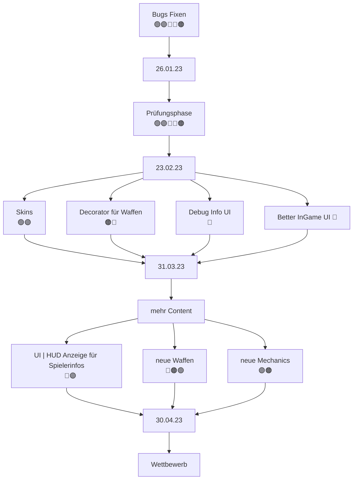

# Teammeeting 26 - 14.04.23

:::info
Nächstes Meeting: 
Protokollant: Niggo
Anwesend: alle
Abwesend: keiner, yee

Anfang: 11:03 Uhr
Ende: Uhr
:::

### Agenda

- Prioritäten setzen

### ...bis zu diesem Meeting..

- Sprinten

### Top 0 - Meeting beginnen

* Blitzlicht
* Protokollant festlegen
* Agenda ansprechen
* Punkte vom letzten Meeting durchgehen

### Top 1 - Allgemeines zum Projekt | Organisatorisches

🟢🟣🔵🔴🟠

- Prioritäten (nach Christian R.)

- 6 Wochen Bearbeitungszeit für die Studis
    - Corny möchte dann 12 Kampagnenmaps erstellen
    - für die erste Deadline 2
   
- Boxen: Schleimblock, Mediblock, Waffenblock
- Waffen: die bisher festgelegten

- Idee für Granate
    - Sollen Anker erzeugt werden, wenn die Granate einen zerstört? (am Rand)
        - Evtl. abhängig von den zerstörten Ankern

- Mehrere Maps
    - 3 Wettbewerb-Maps
        - 1 davon Prüfungszulassung?

- Bots needed

- Punktesystem
    - Corny hat zeugs gemacht, funktion in Gamestate welche Punkte abruft
   
   
Prioritäten und Aufgabenverteilung.

- Kampagne weniger dringend, wichtig: 2 Maps zu Beginn 
    - Laborskins für Gadsen
    - Corny, Yasmin, Niggo
   
- **Boxen** wichtig, sehr dringend
    - Waffenbox, Medibox
    - Schleimbox keine Funktion
    - weniger wichtig: optisch verschiedene Tiles
    - Luke, Yasmin, Corny, Olivia, Niggo

- **Waffen** sehr wichtig, sehr dringend
    - Texturen, Icon, Partikel, Implementierung
    - Alex, Yasmin, Corny, Luke
    

- Laufen 
    - Partikel
    - Können wir den Input-lag noch anpassen?
        - Poll Rate anpassen, keine move Actions queuen, solange eine animiert wird 

- Maps
    - Yasmin
    
- Punktesystem
    - Luke, Corny

#### 1.1 Sprint zusammenfassen

- we did it already

#### 1.2 neuen Sprint festlegen

**Tasks selber erstellen und zuweisen**

### Top 2 Teamleitungen

#### 2.1 Programmierung

#### Turniersystem

- headless Version
    - Parameter: maps,spielerzahl etc.
   
- Architektur reicht nicht aus
    - können derzeit nicht mehrere Spiele/Turnier ausführen
        - bräuchten einen Scheduler

- Manager umgebaut
    - Runs und Runconfigs
        - Run besitzt games und beobachtet diese
        - kümmert sich um die Punkte der abgeschlossenen Games
    - manager scheduled Games und started diese abhängig von verfügbaren Ressourcen
    - Turnier funktioniert nicht mit ui- könnten es einfach nicht erlauben,ein Turnier über gui auszuführen, wäre aber doof

##### Ui-Interface/HUD

- ist auf Beta

**wat is neu?**

- Ausdaueranzeige
- Zugwechsel
- Timer
- Inventar
- FastForward Button
- AimWerte werden angezeigt

- MAUSSTEUERUNG -> KAMERABEWEGUNG MIT RECHTSKLICK GEDRÜCKT -> ZIELEN ALL THE TIME (später mit linksklick gedrückt)

**Improvements under the way**

- Aimen mit Maus1 gedrückt
- Lebensleisten
- Aimindicator semi-transparent

- super secret special feature **Chonky AimIndicator**

- kreis für die Maxreichweite

:::success
Soll der Aim-Indicator Teamfarbe erhalten? Dann evtl. Umrandnug weiß machen.

YEE
:::

#### Matchmaking 

- 4 Spieler werden in allen Permutationen gegeneinander antreten (jeder spielt an allen Spawnpunkten/Teams) 

- wie wollen wir die Phase nach den Gruppen gestalten
    - stark vs stark ist nicht so doll
    - stark vs schwach auch nicht
    - obere hälfte gegen untere hälfte der Tabelle
    - Christians und Thomas fragen, wie das bisher geregelt wurde.

#### Wie wollen wir Spiele handhaben die nie enden?

- Timeout nach x Zügen ohne Schaden (erstmal 10) 

#### 2.2 Design
 Mango Map - 4 Teams á 3 Gadsen
 

Kratzbaum Map - 2 Teams á 3 Gadsen

- weniger Anker
     

#### 2.3 Testing

- TEEEESTS

#### 2.4 Orga

- wir dürfen Merch kaufen
    - wird weitergeleitet und Bürokratisiert
    
    
### Top 3 - ToDos

#### 3.1 - bis zum nächsten Meeting

#### 3.2 - Zeitlich relevantes TO-DO

**Luke**
- [ ] Christians und Thomas zu Preisen etc. fragen

**Olivia**
- [ ] Art

**Niggo**
- [ ] Art
- [ ] Protokoll Backup

**Yasmin**
- [ ] Art 

**Alex**
- [ ] Art

**Corny**

- [ ] Networking
