# Teammeeting 27 - 25.04.23

:::info
Nächstes Meeting: 
Protokollant: Niggo
Anwesend: alle - (Alex+Olivia)
Abwesend: keiner + (Alex+Olivia)

Anfang: 17:30 Uhr
Ende: 18:21 Uhr
:::

### Agenda

- Prioritäten setzen

### ...bis zu diesem Meeting..

- Sprinten

```mermaid
flowchart TD
    goal1["Bugs Fixen 
    🟢🟣🔵🔴🟠"]
    goal2["Prüfungsphase
     🟢🟣🔵🔴🟠"]
    goal3-1["Skins 
    🟢🟣"]
    goal3-2["Decorator für Waffen 
    🟠🔵"]
    goal3-3["Debug Info UI 
    🔴"]
    goal3-4["Better InGame UI 🔴"]
    goal4["mehr Content"]
    feature1["UI | HUD Anzeige für Spielerinfos
    🔴🟣"]
    feature2["neue Waffen
    🔵🟠🟢"]
    feature3["neue Mechanics
    🟣🟠"]
    goal5[Wettbewerb]
   
   date1[26.01.23]
    date2[23.02.23]
    date3[31.03.23]
    date4[30.04.23]
    
    goal1-->date1-->goal2
    goal2-->date2
    date2--> goal3-1 & goal3-2 & goal3-3 & goal3-4
    goal3-1 & goal3-2 & goal3-3 & goal3-4 --> date3
    date3-->goal4
    goal4-->feature1 & feature2 & feature3
    feature1 & feature2 & feature3 --> date4
    date4-->goal5
```

### Top 0 - Meeting beginnen

* Blitzlicht
* Protokollant festlegen
* Agenda ansprechen
* Punkte vom letzten Meeting durchgehen

### Top 1 - Allgemeines zum Projekt | Organisatorisches

#### 1.1 Sprint zusammenfassen

noch nicht durch
- sind trotzdessen gut vorangekommen

#### 1.2 neuen Sprint festlegen

### Top 2 Teamleitungen

#### 2.1 Programmierung

##### Kampagne

- Maps und Bots laden
    - nur bestimmte Maps anzeigen
    - bots für maps vordefinieren
    - waffen vordefinieren

##### Granate-Partikel

- Explosion wird auch beim bouncen erzeugt
    - von der Simulation brauchen wir eine projectile action, für den letzen sprung

##### Inventar

- menge der Waffen anzeigen

##### Turnier

- Probleme mit den Punkten?/Pipeline läuft ewig durch
- was machen wir bei gleichstand im 1v1?
    - Spieler 1 gewinnt
    - Punkte aufteilen?
    
Team mit mehr Punkten gewinnt
    - was wenn beide die ganze Zeit
    - Standardwaffe mit $\infty$ Munition -> für den fall das munition alle und weit weg voneinander
    - Tiles wegnehmen-> bei sümetrischen maps und keiner Bewegung immernoch kein eindeutiger Gewinner
    - GODSE -> unser bot wird gespawnt, welcher random Granaten wirft

##### Sout mit Narnia

können die Studis mit der Wand reden lassen. debuggen mit sout zu verhindern, weil schmerz

#### 2.2 Design

##### Inventar

- Zellhintergrund verändern, sodass die Items besser reinpassen

##### Hammer
- Hammer noch einmal gedreht/seitwärts dargestellt

##### Damageparticle
- zurzeit Flugreise nach Indien
    - anpassen

##### Background

- noch mehr hintergründe für maps

##### Sounds?

#### 2.3 Testing

#### 2.4 Orga
   
    
### Top 3 - ToDos

#### 3.1 - bis zum nächsten Meeting

#### 3.2 - Zeitlich relevantes TO-DO

**Luke**
- [ ] Christians und Thomas zu Preisen etc. fragen

**Olivia**
- [ ] Art

**Niggo**
- [ ] Art
- [ ] Protokoll Backup

**Yasmin**
- [ ] Art 

**Alex**
- [ ] Art

**Corny**

- [ ] Networking
